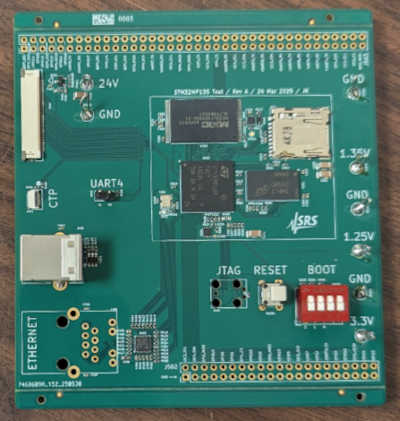
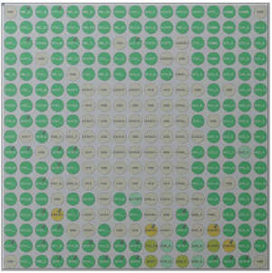

# Test board using STM32MP135

A minimum working example of STM32MP135-based board, breaking out almost all the
pins.

### PCB layout

Find the KiCad files under `kicad/`. This includes the BOM and position files as
used to fabricate the board with JLCPCB. For quick reference, check out the
[`schematics.pdf`](https://github.com/js216/stm32mp135_test_board/blob/81400d63cfe211af686742da545c3347b2757c94/kicad/schematics.pdf).

### CubeMX files

The pin assignment was done using STM32CubeMX. Reluctantly, since it's one of
those bloated modern programs that manage to run slowly even on the fastest
computers available. But it does generate a nice overview of the pin assigment.

### Bare-metal projects

Under `baremetal` you can find a sequence of simple projects for getting started
with debugging this board:

- `blink` will blink the red LED on the board, thus proving that the chip works
  and that we have a way to program it (namely the `uart_boot.py` script,
  described in more details
  [here](https://embd.cc/boot-stm32mp135-over-uart-with-python)).

- `ddr_test`: Initialize DDR3L memory, fill it with pseudorandom bits, and
  confirm that reading from the memory returns the same bit sequence.

### Notes

- No STPMIC1, direct external connections for power supplies
- LSE (external 32.768 kHz) is not connected

### Author

Jakob Kastelic, Stanford Research Systems
