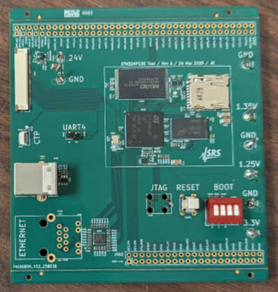
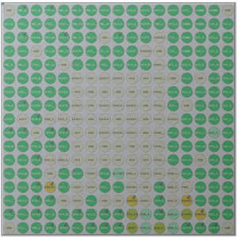

# Test board using STM32MP135

A minimum working example of STM32MP135-based board, breaking out almost all the
pins.

### PCB layout

Find the KiCad files under `kicad/`. This includes the BOM and position files as
used to fabricate the board with JLCPCB. For quick reference, check out the
[`schematics.pdf`](https://github.com/js216/stm32mp135_test_board/blob/81400d63cfe211af686742da545c3347b2757c94/kicad/schematics.pdf).

### CubeMX files

The pin assignment was done using STM32CubeMX. Reluctantly, since it's one of
those bloated modern programs that manage to run slowly even on the fastest
computers available. But it does generate a nice overview of the pin assignment.

### Bare-metal projects

Under `baremetal` you can find a sequence of simple projects for getting started
with debugging this board. (See also the debugging walkthrough in
[this](https://embd.cc/linux-bringup-on-custom-stm32mp135-board) blog post.) The
projects are as follows:

- `blink` will blink the red LED on the board, thus proving that the chip works
  and that we have a way to program it (namely the `uart_boot.py` script,
  described in more details
  [here](https://embd.cc/boot-stm32mp135-over-uart-with-python)).

- `ddr_test`: Initialize DDR3L memory, fill it with pseudorandom bits, and
  confirm that reading from the memory returns the same bit sequence.

- `STM32DDRFW-UTIL`: A simplified version of the
  [tool](https://github.com/STMicroelectronics/STM32DDRFW-UTIL) provided by ST.

- `sd_test`: Initialize SD card, and read out the first few bytes.

- `usb_test`: Checks that data can be loaded from the USB interface (enumerated
  as a "flash drive") to the DDR memory.

All projects are completely independent of each other, and each directory
contains all drivers and other files needed to build the firmware image by just
calling `make`. This means that some of the source files are duplicated; so be
it! BSP packages are in my opinion too "integrated", where everything depends on
everything else. There are occasions---such as this one---where making a copy of
a couple files is the simplest and correct thing to do.

### Building a Linux system

The following directories contain the files needed to build a complete Linux
system image, ready for flashing to the board:

- `bootloader`: USB MSC Bootloader for STM32MP135
  [(link)](https://github.com/js216/stm32mp135-bootloader)
- `linux`: clone of the ST-modified kernel fork
  [(link)](https://github.com/STMicroelectronics/linux)
- `dtbs`: board-specific device tree sources

To build the project, run `make patch all` and watch the SD card image appear
under `build/`. More explanation can be found in
[this](https://embd.cc/build-linux-for-stm32mp135-in-under-50-lines-of-makefile)
blog post, or in the bootloader
[Readme](https://github.com/js216/stm32mp135-bootloader).

*Note:* The
["meta-Makefile"](https://github.com/js216/stm32mp135_test_board/blob/main/Makefile)
for this project is somewhat unusual: it does not track dependencies and its
recipes are fragile, so configuration changes may require editing the recipes
directly. Its purpose is not to provide a robust build system, but to serve as a
shortcut for repetitive command sequences. Being only about 50 lines, modifying
it directly is simpler than learning a separate configuration language. Treat it
as a minimal, linear workflow script wrapped in Make syntax rather than a
conventional build system.

### References

- [Ethernet on Bare-Metal STM32MP13](https://embd.cc/ethernet-on-baremetal-stm32mp135)
- [LCD/CTP on Bare-Metal STM32MP135](https://embd.cc/lcd-ctp-on-baremetal-stm32mp135)
- [Debugging STM32MP135 Kernel Decompression](https://embd.cc/debugging-stm32mp135-kernel-decompression)
- [Build Linux for STM32MP135 in under 50 Lines of Makefile](https://embd.cc/build-linux-for-stm32mp135-in-under-50-lines-of-makefile)
- [SD card on bare-metal STM32MP135](https://embd.cc/sdcard-on-bare-metal-stm32mp135)
- [Unsecuring STM32MP135 TrustZone](https://embd.cc/unsecuring-stm32mp135-trustzone)
- [Linux Bring-Up on a Custom STM32MP135 Board](https://embd.cc/linux-bringup-on-custom-stm32mp135-board)
- [USB Bring-Up on a Custom STM32MP135 Board](https://embd.cc/usb-bringup-on-custom-stm32mp135-board)
- [STM32MP135 Flashing via USB with STM32CubeProg](https://embd.cc/stm32mp135-linux-cubeprog)
- [Boot STM32MP135 Over UART With Python](https://embd.cc/boot-stm32mp135-over-uart-with-python)
- [Buildroot files for a similar project](https://github.com/js216/stm32mp135_simple/tree/main)

### Author

Jakob Kastelic, Stanford Research Systems

NOTE: PORTIONS OF THIS REPOSITORY CONTAIN SOURCE CODE COPYRIGHTED BY
STMICROELECTRONICS. SUCH FILES ARE PROVIDED UNDER STMICROELECTRONICS' ORIGINAL
LICENSE TERMS, WHICH ARE INCLUDED WITH THOSE FILES. NO RIGHTS ARE GRANTED BEYOND
THOSE TERMS. THIS REPOSITORY MAY NOT BE USED WITH NON-ST HARDWARE UNLESS
PERMITTED BY ST'S LICENSE. ALL PROPRIETARY NOTICES MUST REMAIN INTACT.
